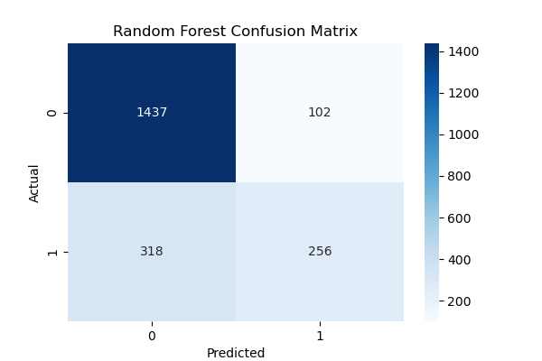
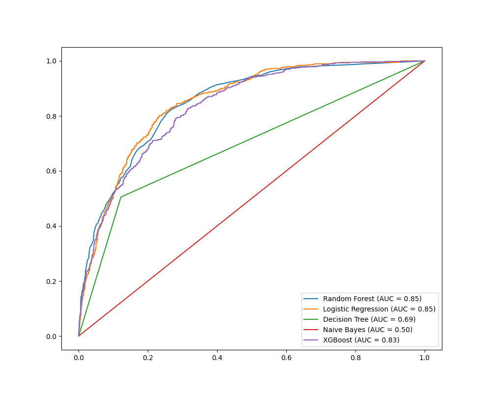

# Telco Customer Churn Prediction

## 📝 Project Overview
This project aims to **predict customer churn** using the **Telco Customer Churn** dataset from [Kaggle](https://www.kaggle.com/blastchar/telco-customer-churn). The goal is to **identify customers likely to leave** and enable proactive retention strategies. This is an **end-to-end machine learning pipeline** covering:

✅ **Data Exploration** (EDA)  
✅ **Data Preprocessing** (Handling missing values, encoding, scaling)  
✅ **Model Training & Hyperparameter Tuning**  
✅ **Feature Selection & Feature Importance Analysis**  
✅ **API Development** (FastAPI & Uvicorn)  
✅ **Cloud Deployment** (Azure Web Apps, Azure Key Vault)  
✅ **Model Performance Evaluation**  

---

## 📂 Project Structure

telco-customer-churn/ ├── data/ # Dataset storage │ ├── raw/ # Raw data from Kaggle │ └── processed/ # Cleaned and preprocessed data ├── notebooks/ # Jupyter notebooks for EDA and model training ├── src/ # Source code for the project │ ├── init.py │ ├── data_preprocessing.py │ ├── feature_engineering.py │ ├── model_training.py │ ├── model_evaluation.py │ └── api_utils.py ├── deployment/ # API deployment scripts │ ├── app.py # FastAPI application │ ├── Dockerfile # Docker container setup │ └── requirements.txt # Dependencies for deployment ├── logs/ # API logs for debugging ├── output/ # Model performance and visualization results │ ├── Learning Curves.png │ ├── random_forest_confusion_matrix.png │ ├── random_forest_feature_importance.png │ ├── roc_all_models.png │ ├── roc_decision_tree.png │ ├── roc_gradient_boosting.png │ ├── roc_logistic_regression.png │ ├── roc_naive_bayes.png │ ├── roc_random_forest.png │ ├── roc_xgboost.png │ ├── tuned_random_forest_confusion_matrix.png ├── tests/ # Unit tests ├── .gitignore # Files to ignore in Git ├── README.md # Project documentation ├── requirements.txt # Project dependencies └── config.yaml # Configuration file for parameters

---

## 📊 Dataset Overview
- **Source:** [Kaggle Telco Churn Dataset](https://www.kaggle.com/blastchar/telco-customer-churn)
- **Rows:** 7,043 customer records
- **Columns:** 21 (customer demographics, account details, service usage)
- **Target Variable:** `Churn` (1 = Customer left, 0 = Retained)

### 📌 **Key Features:**
- **`tenure`** - Number of months the customer stayed  
- **`MonthlyCharges`** - Amount charged per month  
- **`TotalCharges`** - Total amount charged  
- **`Contract`** - Type of contract (Month-to-month, One year, Two years)  

## 📈 **Key Visualizations**

### 📌 **1️⃣ Learning Curves**  
Understanding model training performance.  

### 📌 **2️⃣ Feature Importance (Top Predictors of Churn)**  
Identifying key factors affecting churn.  

### 📌 **3️⃣ Confusion Matrix for Random Forest**  
Evaluating model classification results.  

### 📌 **4️⃣ ROC Curve - All Models Comparison**  
Comparing AUC scores across multiple models.  

### 📌 **5️⃣ ROC Curve - XGBoost (Best Model)**  
Performance of the best-performing model.  

---

## ⚙️ **Tech Stack Used**
- **Machine Learning:** XGBoost, Random Forest, Gradient Boosting  
- **Data Processing:** Pandas, NumPy, Scikit-learn  
- **API Development:** FastAPI, Uvicorn  
- **Cloud Services:** Azure Web Apps, Azure Key Vault  
- **Logging & Monitoring:** Rotating File Logging  

---

## 🚀 **Project Workflow**
### **1️⃣ Data Preprocessing**
- **Handling Missing Values** (`TotalCharges` converted to numeric)
- **Encoding Categorical Features** (Label encoding & One-Hot Encoding)
- **Feature Scaling** (StandardScaler for numerical features)

### **2️⃣ Exploratory Data Analysis (EDA)**
- **Histograms & Boxplots** for `MonthlyCharges`, `tenure`
- **Churn Distribution Analysis**
- **Correlation Matrix & Feature Importance**

### **3️⃣ Model Training**
- **Baseline Models**: Logistic Regression, Decision Tree  
- **Advanced Models**: Random Forest, Gradient Boosting, XGBoost  
- **Hyperparameter Tuning**: RandomizedSearchCV  

### **4️⃣ Model Evaluation**
- **Metrics Used:** Accuracy, Precision, Recall, ROC-AUC  
- **Best Model:** `XGBoost` (Achieved **ROC-AUC = 0.8557**)  

---

## 🌐 **API Development**
**FastAPI-based REST API** for churn prediction.

### 📌 **Endpoints**
| Method | Endpoint  | Description |
|--------|----------|-------------|
| GET    | `/`      | API Health Check |
| POST   | `/predict` | Predicts if a customer will churn |

### 🔐 **API Security**
- API Key Authentication (`X-API-KEY` header)
- API Logs stored in `logs/api_logs.log`

### 📌 **Example API Call**
curl -k -X POST "https://telco-churn-api.azurewebsites.net/predict" \
     -H "Content-Type: application/json" \
     -H "X-API-KEY: YOUR_API_KEY" \
     -d '{
        "TotalCharges": 5000.0,
        "MonthlyCharges": 80.0,
        "tenure": 24,
        "Contract": 2,
        "PaymentMethod": 3,
        "OnlineSecurity": 1
     }'

### **Example Response**

{
    "churn_prediction": 0,
    "churn_probability": 0.0283,
    "response_time": 0.0034
}

### **Azure Deployment**

1. Azure Key Vault (For API Key Security)
	Step 1: Create Azure Key Vault
		az keyvault create --name YourKeyVault --resource-group MyResourceGroup --location region
		
	Step 2: Store API Key in Key Vault
		az keyvault secret set --vault-name YourKeyVault --name API-KEY --value "your_api_key_here"
		
	
	Step 3: Retrieve API Key in Python
	
		import os
		from azure.identity import DefaultAzureCredential
		from azure.keyvault.secrets import SecretClient

		vault_url = "https://himanshukeyvault.vault.azure.net/"
		credential = DefaultAzureCredential()
		client = SecretClient(vault_url, credential)

		API_KEY = client.get_secret("API-KEY").value
		os.environ["API_KEY"] = API_KEY

### **Model Performance**

	Model					Accuracy	Precision	Recall	ROC-AUC
	Logistic Regression			78%			0.81	0.30	0.85
	Random Forest				77%			0.82	0.21	0.84
	Gradient Boosting			79%			0.83	0.25	0.86
	XGBoost (Best)				81%			0.84	0.30	0.8557
	
	
	Key Findings
✔️ MonthlyCharges & tenure are the most important churn predictors
✔️ XGBoost performed best with 81% accuracy & AUC = 0.8557
✔️ Feature Selection improved performance & reduced overfitting

### 📈 **Visualizations**
🔹 Confusion Matrix

🔹 Feature Importance (Top Predictors of Churn)

🔹 ROC-AUC Curve

### How to Run Locally
1) Clone Repository
	git clone https://github.com/himanshu-dandle/telco-customer-churn.git
	cd telco-customer-churn
	
2) Install Dependencies
	pip install -r requirements.txt
	
3️) Model Training
	python src/customer_churn_prediction.py

4)  Run FastAPI Server

	uvicorn deployment.app:app --reload

5) Deploy to Azure

	az webapp up --name telco-churn-api --resource-group MyResourceGroup

### Future Work
Improve Model Performance (Try deep learning models like LSTMs)
Deploy Interactive Dashboard (Streamlit for real-time churn predictions)
Enhance API with More Features (Batch predictions, customer segmentation)

