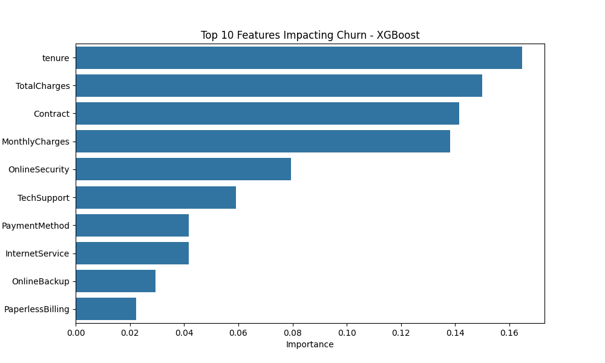
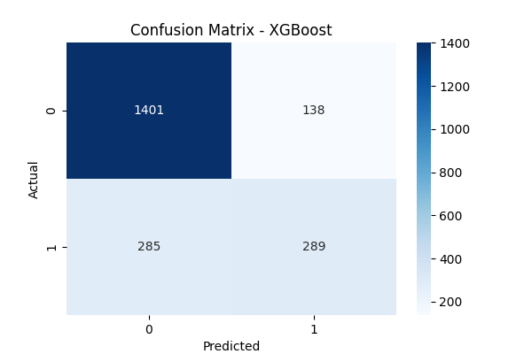
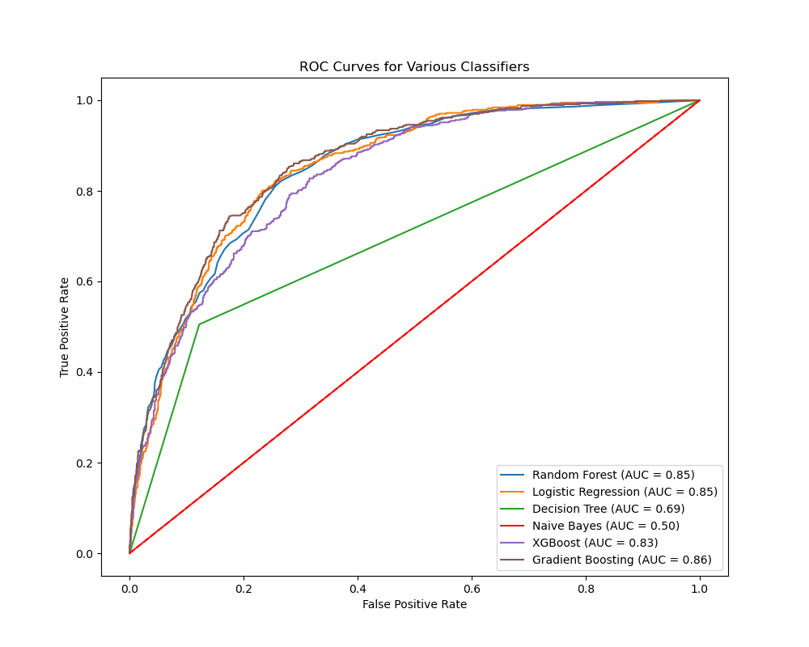
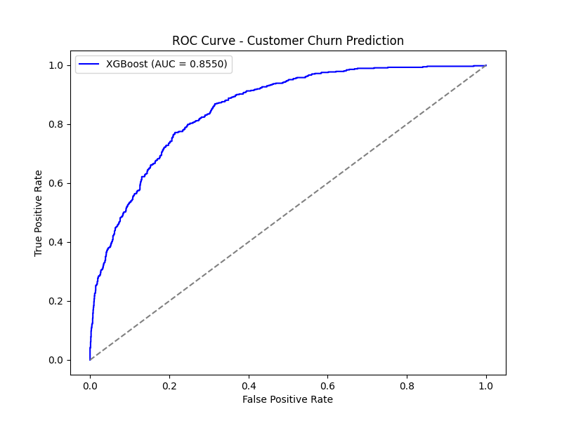

# Telco Customer Churn Prediction

## 📝 Project Overview
This project aims to **predict customer churn** using the **Telco Customer Churn** dataset from [Kaggle](https://www.kaggle.com/blastchar/telco-customer-churn). The goal is to **identify customers likely to leave** and enable proactive retention strategies. This is an **end-to-end machine learning pipeline** covering:
✅ Data Exploration (EDA)  
✅ Data Preprocessing (Handling missing values, encoding, scaling)  
✅ Model Training & Hyperparameter Tuning  
✅ Feature Selection & Feature Importance Analysis  
✅ API Development (FastAPI & Uvicorn)  
✅ Cloud Deployment (Azure Web Apps, Azure Container Registry, Azure Key Vault)  
✅ Model Performance Evaluation

---

## 📂 Project Structure
```
telco-customer-churn/
│
├── .azure/                 # Azure-related deployment files
├── churn_env/              # Virtual environment (should be in .gitignore)
├── dashboard/              # Streamlit or dashboard-related module (if applicable)
├── dashboard-react/        # React & TypeScript dashboard for visualizing churn data
│
├── data/                   # Dataset storage
│   ├── raw/                # Raw data from Kaggle
│   ├── processed/          # Cleaned and preprocessed data
│   └── output/             # Model performance & visualization results
│
├── deployment/             # API deployment scripts
│   ├── Dockerfile          # Docker container setup
│   ├── requirements.txt    # Dependencies for deployment
│
├── logs/                   # API logs for debugging
│
├── notebooks/              # Jupyter notebooks for EDA and model training
│   ├── customer_churn_prediction.ipynb
│
├── src/                    # Source code for ML pipeline
│   ├── app.py              # FastAPI application
│   ├── model_training.py   # Model training script (if applicable)
│   ├── model_evaluation.py # Model evaluation script (if applicable)
│   ├── api_utils.py        # API helper functions (if applicable)
│
├── tests/                  # Unit tests (currently empty)
│
├── __pycache__/            # Compiled Python files (should be in .gitignore)
│
├── .gitignore              # Files to ignore in Git
├── README.md               # Project documentation
├── requirements.txt        # Project dependencies
└── main.py                 # Main script (if needed)
```
---

## 📊 Dataset Overview
- **Source:** [Kaggle Telco Churn Dataset](https://www.kaggle.com/blastchar/telco-customer-churn)
- **Rows:** 7,043 customer records
- **Columns:** 21 (customer demographics, account details, service usage)
- **Target Variable:** `Churn` (1 = Customer left, 0 = Retained)

###  **Key Features:**
- **`tenure`** - Number of months the customer stayed  
- **`MonthlyCharges`** - Amount charged per month  
- **`TotalCharges`** - Total amount charged  
- **`Contract`** - Type of contract (Month-to-month, One year, Two years)  


## 📈 **Key Visualizations**

###  **Feature Importance (Top Predictors of Churn)**  
Identifying key factors affecting churn.  


###  **Confusion Matrix for XG Boost**  
Evaluating model classification results.  


###  **ROC Curve - All Models Comparison**  
Comparing AUC scores across multiple models.  


###  **ROC Curve - XGBoost (Best Model)**  
Performance of the best-performing model.  


---

## ⚙️ **Tech Stack Used**
- **Machine Learning:** XGBoost, Random Forest, Gradient Boosting  
- **Data Processing:** Pandas, NumPy, Scikit-learn  
- **API Development:** FastAPI, Uvicorn  
- **Cloud Services:** Azure Web Apps, Azure Key Vault  
- **Logging & Monitoring:** Rotating File Logging  

---

## 🚀 **Project Workflow**
### **1️⃣ Data Preprocessing**
- **Handling Missing Values** (`TotalCharges` converted to numeric)
- **Encoding Categorical Features** (Label encoding & One-Hot Encoding)
- **Feature Scaling** (StandardScaler for numerical features)

### **2️⃣ Exploratory Data Analysis (EDA)**
- **Histograms & Boxplots** for `MonthlyCharges`, `tenure`
- **Churn Distribution Analysis**
- **Correlation Matrix & Feature Importance**

### **3️⃣ Model Training**
- **Baseline Models**: Logistic Regression, Decision Tree  
- **Advanced Models**: Random Forest, Gradient Boosting, XGBoost  
- **Hyperparameter Tuning**: RandomizedSearchCV  

### **4️⃣ Model Evaluation**
- **Metrics Used:** Accuracy, Precision, Recall, ROC-AUC  
- **Best Model:** `XGBoost` (Achieved **ROC-AUC = 0.8557**)  

---

## 🌐 **API Development**
**FastAPI-based REST API** for churn prediction.

###  **Endpoints**
| Method | Endpoint   | Description |
|--------|----------- |-------------|
| GET    | `/`        | API Health Check |
| POST   | `/predict` | Predicts if a customer will churn |

###  **API Security**
- API Key Authentication (`X-API-KEY` header)
- API Logs stored in `logs/api_logs.log`

###  **Example API Call**
curl -k -X POST "https://telco-churn-api.azurewebsites.net/predict" \
     -H "Content-Type: application/json" \
     -H "X-API-KEY: YOUR_API_KEY" \
     -d '{
        "TotalCharges": 5000.0,
        "MonthlyCharges": 80.0,
        "tenure": 24,
        "Contract": 2,
        "PaymentMethod": 3,
        "OnlineSecurity": 1
     }'

### **Example Response**

{
    "churn_prediction": 0,
    "churn_probability": 0.0283,
    "response_time": 0.0034
}


### How to Run Locally
1️⃣ Clone the Repository

git clone https://github.com/your-username/telco-customer-churn.git
cd telco-customer-churn
2️⃣ Create & Activate Virtual Environment

python -m venv venv
source venv/bin/activate  # On macOS/Linux
venv\Scripts\activate     # On 

3️⃣ Install Dependencies

pip install -r requirements.

4️⃣ Run the FastAPI Server
uvicorn app:app --host 0.0.0.0 --port 8000 --reload
5️⃣ Test API in Browser or Postman
Open: http://127.0.0.1:8000/docs to test the API interactively.


### **Azure Deployment**

**🔹 Build & Push Docker Image to Azure Container Registry (ACR)**

	1. Login to Azure:
	   
	   az login

	2. Set variables:

		ACR_NAME=himanshuacr
		IMAGE_NAME=churn-api
		RESOURCE_GROUP=MyResourceGroup
		
	3. Login to ACR:
		az acr login --name $ACR_NAME
	4. Build & Push the Docker image:
		docker build -t $ACR_NAME.azurecr.io/$IMAGE_NAME:latest .
		docker push $ACR_NAME.azurecr.io/$IMAGE_NAME:latest

**🔹 Deploy the Container to Azure Web**

	1. Create an Azure Web App with Docker container:
		az webapp create --resource-group $RESOURCE_GROUP --plan MyAppServicePlan \
		--name telco-churn-api --deployment-container-image-name $ACR_NAME.azurecr.io/$IMAGE_NAME:latest
	2. Set ACR authentication for the Web App:
		az webapp config container set --name telco-churn-api --resource-group $RESOURCE_GROUP \
		--docker-custom-image-name $ACR_NAME.azurecr.io/$IMAGE_NAME:latest \
		--docker-registry-server-url https://$ACR_NAME.azurecr.io \
		--docker-registry-server-user <YOUR_ACR_USERNAME> \
		--docker-registry-server-password <YOUR_ACR_PASSWORD>
	3. Restart the Web App:
		az webapp restart --name telco-churn-api --resource-group $RESOURCE_GROUP
	4. Verify the Deployment:
		az webapp show --name telco-churn-api --resource-group $RESOURCE_GROUP --query "defaultHostName"

***🔹 Your API should now be live at**
	https://telco-churn-api.azurewebsites.net/docs

###  **Dashboard Integration**
In addition to the API, an interactive dashboard built with React and TypeScript is provided to visualize churn analysis data.

# Dashboard Setup
	1. Navigate to the Dashboard Folder:
		cd dashboard-react
	2. Install Dependencies:
		npm install
	3. Start the Development Server:
		npm start

This will open the dashboard in your browser at http://localhost:3000. 

The dashboard currently displays a header and a static churn rate, which serves as a placeholder for future dynamic data integration.
	Dashboard Overview
	Header: "Telco Customer Churn Dashboard"
	Static Data: Displays a churn rate (currently 15.5%)

# Future Enhancements:
Integrate dynamic data from the churn analysis pipeline (e.g., via a JSON file or API).
Add interactive visualizations using charting libraries such as Chart.js or Recharts.


### **Model Performance**

	Model					Accuracy	Precision	Recall	ROC-AUC
	Logistic Regression			78%			0.81	0.30	0.85
	Random Forest				77%			0.82	0.21	0.84
	Gradient Boosting			79%			0.83	0.25	0.86
	XGBoost (Best)				81%			0.84	0.30	0.8557
	
	
	Key Findings
✔️ MonthlyCharges & tenure are the most important churn predictors
✔️ XGBoost performed best with 81% accuracy & AUC = 0.8557
✔️ Feature Selection improved performance & reduced overfitting


### 📈 **Visualizations**
🔹 Confusion Matrix

🔹 Feature Importance (Top Predictors of Churn)

🔹 ROC-AUC Curve


### Future Work
🔹 Improve Model Performance (Try deep learning models like LSTMs)
🔹 Deploy Interactive Dashboard (Streamlit for real-time churn predictions)
🔹 Enhance API with More Features (Batch predictions, customer segmentation)


### 📜 License
This project is open-source and available under the MIT License.


