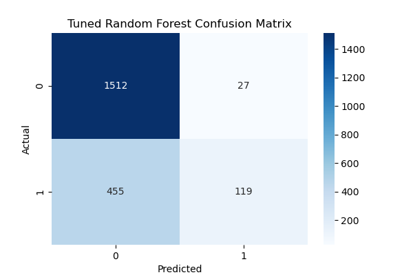
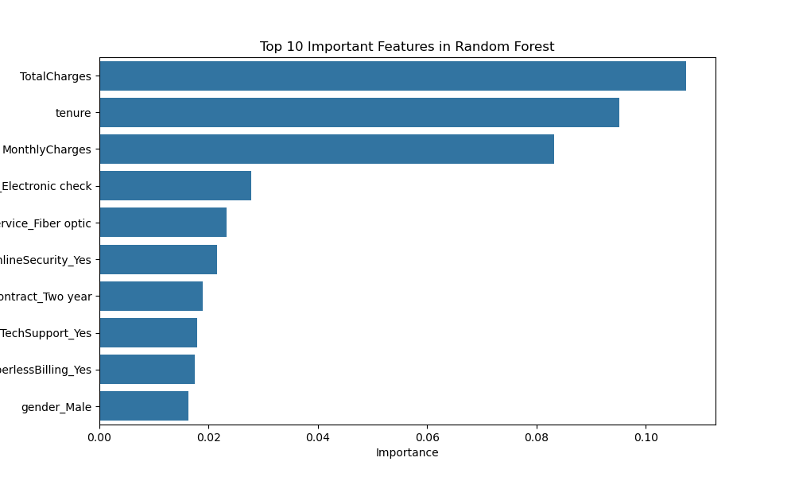
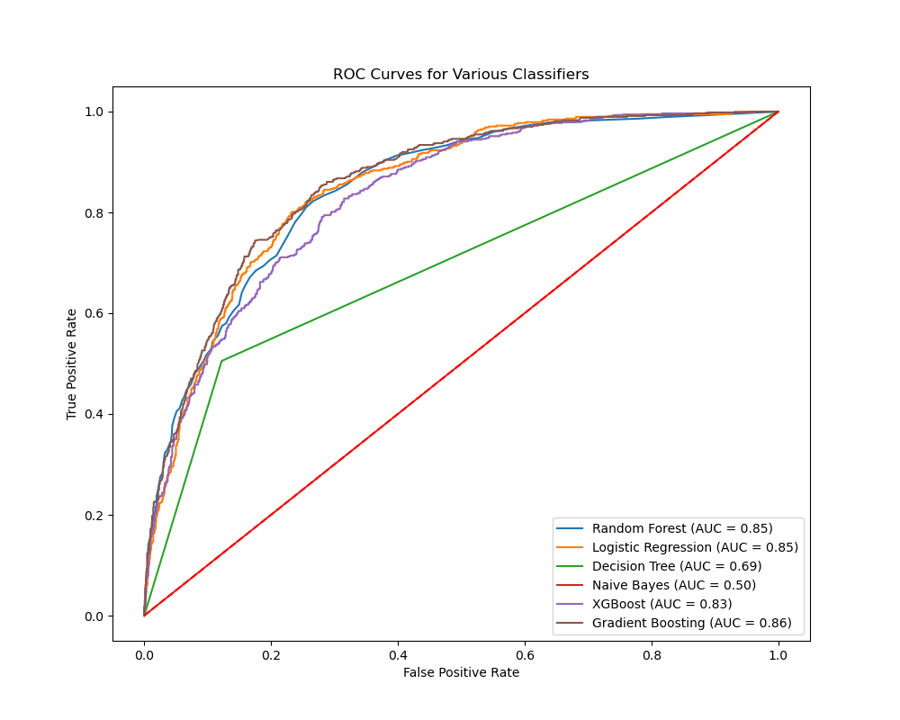

# Telco Customer Churn Prediction

This project aims to predict customer churn using the **Telco Customer Churn** dataset from [Kaggle](https://www.kaggle.com/blastchar/telco-customer-churn). We apply several machine learning models, including **Random Forest**, **Logistic Regression**, **Decision Trees**, and **Gradient Boosting**, to analyze customer churn and provide actionable insights.

## Project Overview:
- **Goal**: - This project focuses on predicting customer churn using the Telco Customer Churn dataset. Churn refers to customers who have left a service, and predicting churn can help businesses take proactive 		measures to retain customers. This end-to-end machine learning pipeline covers the following stages:

	Data Exploration
	Data Preprocessing (Handling missing values, encoding, scaling)
	Model Building and Training
	Hyperparameter Tuning
	Evaluation Metrics (Accuracy, Precision, Recall, F1-Score, AUC)
	Feature Importance Analysis
	Final Model and Recommendations for Future Improvements

- **Dataset**: The dataset contains customer records from a hypothetical telecom company, including demographics, account details, and usage statistics.

	- **Rows**: 7,043 customers
	- **Columns**: 21 features including customer demographics, account details, and service usage.
	- **Target Variable**: `Churn` (whether a customer left the company).
	Key Features:
		tenure: Number of months the customer has stayed with the company
		MonthlyCharges: The amount charged to the customer monthly
		TotalCharges: The total amount charged
		Churn: Whether the customer churned or not (target variable
	
- **Techniques Used**:
  - **Data Preprocessing**: Handling missing values, encoding categorical variables, and scaling numerical features.
  - **Exploratory Data Analysis (EDA)**: Visualizing important relationships and patterns within the data.
  - **Modeling**: Training several machine learning models and evaluating their performance.
  - 
## Project Structure
customer-churn-prediction/
    ├── data/                  # Raw dataset
    ├── notebooks/             # Jupyter notebooks for analysis and modeling
    ├── output/                # Saved model performance plots, feature importance plots
    ├── README.md              # Project overview, steps, and results
    ├── requirements.txt       # Dependencies for the project
    └── customer_churn_prediction.py # Main Python script for model training
    
## Project Steps:
1. **Data Preprocessing**:
   - Handled missing values (e.g., `TotalCharges`).
   - Converted categorical features into numerical values using one-hot encoding.
   - Scaled numerical features like `MonthlyCharges`, `tenure`, and `TotalCharges` for model compatibility.\
   
2. **Exploratory Data Analysis (EDA)**:
   - Analyzed key features like customer demographics, services, and account information.
   - Visualized relationships between features like **MonthlyCharges** and churn probability.
   - Created visualizations for churn patterns using histograms, correlation matrices, and bar charts.

3. **Modeling**:
   - Trained several classification models, including **Random Forest**, **Logistic Regression**, **Decision Trees**, and **Gradient Boosting**.
   - Applied **cross-validation** and tuned hyperparameters using **RandomizedSearchCV** to improve model performance.

4. **Model Evaluation**:
   - Evaluated models using metrics such as **accuracy**, **precision**, **recall**, **F1-score**, and **ROC-AUC**.
   - Compared model performance and selected the best model for churn prediction.

## Results:
- **Best Model**: The **Random Forest** classifier with the following performance:
  - **Accuracy**: 77.19%
  - **ROC-AUC Score**: 0.8481, indicating strong discriminatory power between churn and non-churn customers.
  
- **Feature Importance**:
  - The most important features for predicting churn are:
    1. **MonthlyCharges**
    2. **tenure**
    3. **Contract type**

## Improvements:
- **Class Imbalance**: Applied **SMOTE** to address class imbalance by generating synthetic samples for the minority (churn) class.
- **Hyperparameter Tuning**: Performed hyperparameter tuning using **RandomizedSearchCV** to improve model performance and ensure the model generalizes well to unseen data.


## Visualizations:
Here are some key visualizations from the analysis:

### Confusion Matrix:


### Feature Importance:
The top 3 important features in predicting churn are:
MonthlyCharges
tenure
TotalCharges



### ROC-AUC Curve:


These visualizations provide insights into model performance and the importance of key features in predicting customer churn.

## Model Performance Comparison:
| Model               | Accuracy | Precision | Recall | ROC-AUC |
|---------------------|----------|-----------|--------|---------|
| Logistic Regression  | 0.78     | 0.81      | 0.30   | 0.85    |
| Random Forest        | 0.77     | 0.82      | 0.21   | 0.84    |
| Gradient Boosting    | 0.79     | 0.83      | 0.25   | 0.86    |

Best Model: Gradient Boosting achieved the highest AUC score of 0.86, while Random Forest and Logistic Regression also performed strongly.

## Future Work
Advanced Hybrid Methods: Explore weighted combinations of models for better accuracy.
Incorporate More Data: Include user demographics or implicit feedback like clicks.
Try New Models: Experiment with models like Neural Collaborative Filtering or deep learning approaches.
Optimize Hyperparameters: Use techniques like Bayesian optimization to improve performance.
Improve Coverage: Focus on increasing diversity in recommendations for a wider variety of items.

## Setup Instructions
1. Clone the repository:
   ```bash
   git clone https://github.com/himanshu-dandle/telco-customer-churn.git
2.Install the dependencies:
	pip install -r requirements.txt
	
3.Run the Jupyter notebook or Python script to train the models:
	jupyter notebook notebooks/customer_churn_prediction.ipynb
 
## Conclusion
This project demonstrates how to build an end-to-end machine learning pipeline for predicting customer churn. With Random Forest and Gradient Boosting achieving the best performance, further improvements could be made by addressing class imbalance and incorporating additional features.


